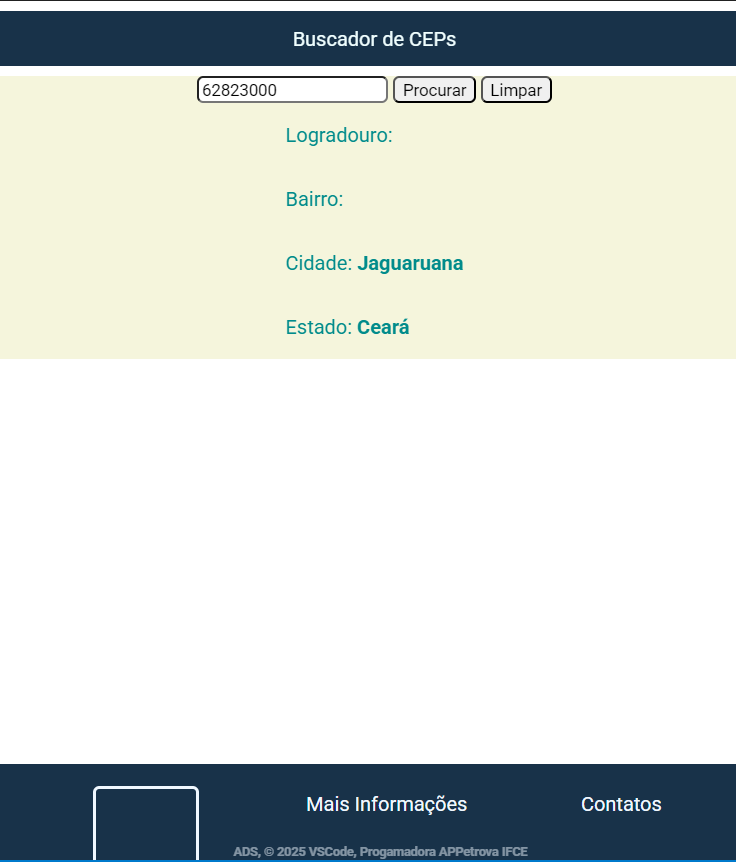

# Projeto buscador de Ceps
O objetivo do projeto é pesquisar CEPs em uma api camada https://viacep.com.br/ws/${cep.value}/json/

## Design do projeto

## API utilizada
a api https://viacep.com.br retorna um json contendo as seguintes informações para um cep de exemplo: 62823000

```
https://viacep.com.br/ws/62823000/json/

{
  "cep": "62823-000",
  "logradouro": "",
  "complemento": "",
  "unidade": "",
  "bairro": "",
  "localidade": "Jaguaruana",
  "uf": "CE",
  "estado": "Ceará",
  "regiao": "Nordeste",
  "ibge": "2307007",
  "gia": "",
  "ddd": "88",
  "siafi": "1441"
}
```
## Funcionalidas
- [x] # Busca CEPs
- [x] Limpar dados
- [ ] Melhorado o design
- [ ] Responsividade
- [ ] Rodapé

## Observações
> [!Note]
> Projeto feito na disciplina de programação web I do curso ADS de ifce de Jaguaruana.

>[!IMPORTANT]
> Alguns CEPs podem não conter todas as informações.

## Contatos
Email: ana.paula.silva06@aluno.ifce.edu.br